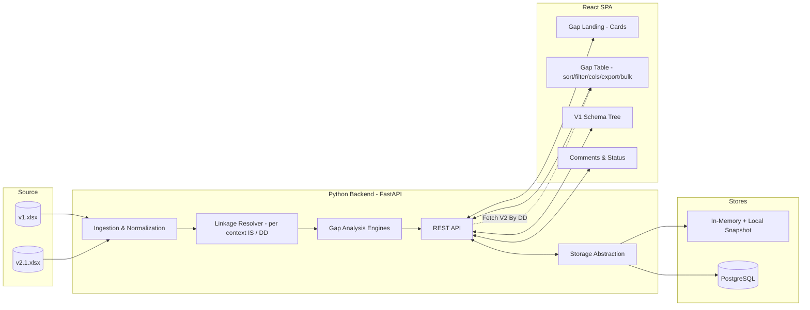
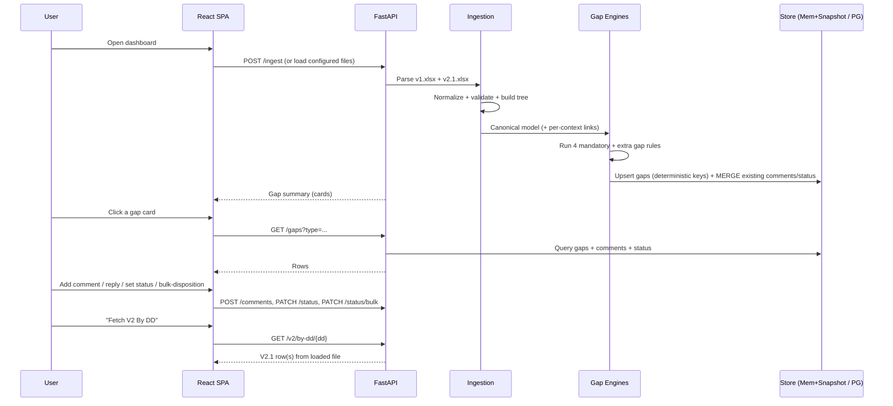

# High-Level Design (HLD)
## V2.1 → V1 Schema Conversion — Data Impact & Gap-Analysis Dashboard

| | |
|---|---|
| **Document type** | High-Level Design (HLD) |
| **Project** | V2.1 → V1 Message Schema Conversion — Data Impact Analysis |
| **Version** | 1.2 (Draft) |
| **Date** | 2026-06-05 |
| **Author** | Senior Data Architect |
| **Status** | For review / discussion |
| **Audience** | Data architects, schema SMEs, BAs, backend & frontend engineers, QA |

> **Grounding note.** Every column, linkage, and gap rule in this document is derived strictly from the two provided workbooks (`v1.xlsx`, `v2.1.xlsx`). The *cell values* in those files are dummy samples; the *column structure* is treated as the contract. The production data set is expected to contain **~2,000 rows** with richer combinations (notably **array / repeating nodes** and deeper nesting). No data points have been invented beyond what the files contain.

### Revision history
| Ver | Date | Change |
|---|---|---|
| 1.0 | 2026-06-05 | Initial HLD |
| 1.1 | 2026-06-05 | Confirmed **per-context mapping** (Entity / RP IND / RP ORG = 3 facets of one business object); confirmed `Nullable=False ⇒ Mandatory`; "Fetch V2 By DD" reads the **loaded** v2.1 file; **in-memory store now durable** via local snapshot. Added glossary, gap severity, audit trail, bulk disposition, saved views, re-ingest merge. |
| 1.2 | 2026-06-05 | Added **comment-retention on Excel re-upload, anchored to the IS Reference Number** (F13); `gap_id` changed to a **position-independent business key** so comments survive row reordering. Confirmed comment **author = locally-entered display name**. Closed open questions Q1–Q5 (deemed not relevant to this project by stakeholder); Q6 confirmed. |

---

## 1. Purpose & Scope

### 1.1 Purpose
Messages are being migrated **from the V2.1 schema to the legacy V1 schema**. Before transformation logic is built, the team needs a **data-impact / gap analysis** that highlights every structural and semantic difference between the two schemas at the field level, so the differences can be discussed and dispositioned by SMEs.

This tool is a **local, collaborative analysis workbench** that:
1. Ingests the V1 and V2.1 schema definitions (Excel today; pluggable later).
2. Resolves the V1 ⇄ V2.1 linkage via **IS Numbers** across **three mapping contexts** (and secondarily **DD numbers**).
3. Runs the mandatory **gap-analysis rules** and surfaces results.
4. Lets stakeholders **comment (threaded), reply, and disposition** each gap.
5. Presents results both as **gap cards + tables** and as a **V1 schema tree** with gaps attached to each node.

### 1.2 In scope
- Excel ingestion of V1 and V2.1 schema sheets.
- Linkage resolution (per-context) and the four mandatory gap analyses (+ recommended additional gaps, §9).
- Collaboration layer: threaded comments, status workflow, audit trail, "Fetch V2 By DD".
- Two UI surfaces: **Gap landing page (cards → table)** and **V1 tree page**.
- Table UX: sort, filter, column show/hide, export, bulk disposition, saved views.
- Dual storage: **durable in-memory (local snapshot)** and **PostgreSQL**, selectable by configuration.
- Python backend, React frontend, **runs locally**.

### 1.3 Out of scope (deferred to a later phase, per requirement)
- Deployment / hosting / CI-CD architecture.
- Security architecture (authn/authz, encryption, RBAC, audit hardening). *Note: lightweight author attribution and change timestamps are included now as data, not as security controls.*
- The actual V2.1→V1 **transformation/mapping engine** (this tool informs it, it does not perform the conversion).
- Real-time integration with upstream V2 master-data services beyond the defined "Fetch V2 By DD" lookup (which reads the loaded v2.1 file this phase).

### 1.4 Success criteria
- 100% of V1 fields are classified against V2.1 (mapped / unmapped) **per mapping context**, with the linkage logic auditable.
- All four mandatory gap rules produce deterministic, reproducible, explainable results.
- Every gap can be commented on, replied to, and moved through `Open → Accepted / Not applicable`, with the change attributed and timestamped.
- Collaboration data survives application restarts in **both** storage modes.
- Comments survive a **new Excel upload**: a discussion raised against an IS Reference Number stays attached to that IS even if its row position changes.
- Tool remains responsive at the target scale (~2,000 rows, with array nodes).
- Zero fabricated data: every displayed value is traceable to a source cell.

### 1.5 Glossary
> Factual definitions come from the workbook columns. Items marked **(interpreted — confirm)** are reasonable expansions not stated in the files; they are listed as open questions (§15) and are **not** relied upon by any rule.

| Term | Meaning |
|---|---|
| **IS Number / IS Reference Number** | The V1 field identifier (`v1.xlsx → IS Reference Number`); the primary join key. |
| **DD number** | `v1.xlsx → CC DD Ref No` and `v2.1.xlsx → Source DD#`; secondary key; powers "Fetch V2 By DD". |
| **Mapping context** | One of the three V2.1 columns that links to a V1 IS: **Entity**, **RP IND**, **RP ORG** — confirmed by the SME as three facets of one logically-grouped business object. A single V2.1 row may map to a *different* V1 IS in each. |
| **Node / Root / Element** | Row role: `Root` = structural node carrying occurrence; `Element` = leaf field. (`v1.xlsx → Node`, `v2.1.xlsx → Node / Element`.) |
| **Array / repeating node** | A node whose `Max Occurrence` is >1 or unbounded (V2.1 also hints via `Remarks For Repeating Block`). |
| **Gap** | A detected difference between V1 and V2.1 for an IS in a context, produced by a gap engine. |
| **RP IND / RP ORG** | Responsible Party — Individual / Organisation **(interpreted — confirm)**. |
| **CC / CCDM / CLMT / CLM** | Source-system prefixes/codes appearing in column names; business meaning not given in the files **(interpreted — confirm)**. |

---

## 2. Background — the two schemas (as-provided)

### 2.1 V1 schema columns (`v1.xlsx`, 16 columns)
`IS Reference Number` · `CC DD Ref No` · `Node` · `Level 1` … `Level 8` · `Attribute` · `XSD Field Type` · `Nullable` · `Min Occurrence` · `Max Occurrence`

- **Hierarchy** is expressed by the `Node` column (observed values: `Root`, `Element`) plus the `Level 1…Level 8` path columns.
- **Structural rows** (`Node = Root`) carry `Min Occurrence` / `Max Occurrence` (e.g. 1/1).
- **Leaf rows** (`Node = Element`) carry the field identity: `IS Reference Number`, `Attribute`, `XSD Field Type`, `Nullable` (boolean).

### 2.2 V2.1 schema columns (`v2.1.xlsx`, 20 columns)
`Schema Name + JSON Path` · `CLMT IS Reference Number` · `Version Number` · `Change Log` · `Attribute CLM ID` · `CCDM Attribute Name` · `Source DD#` · `CC_V1_Mapping Entity` · `CC_V1_Mapping RP IND` · `CC_V1_Mapping RP ORG` · `Remarks For Repeating Block` · `Node / Element` · `Schema Name` · `JSON Attribute Name` · `Data Type` · `Min Occurrence` · `Max Occurrence` · `Mandatory / Optional` · `Schema + JSON Path + Attribute` · `Mapping Remarks`

- **Hierarchy** is expressed by `Node / Element` (observed: `Node`, `Element`) plus JSON path columns.
- **Repeating/array** semantics are flagged via `Remarks For Repeating Block` and the `Min/Max Occurrence` pair.

### 2.3 Linkage model — **per-context** (the join key)
The V1 ⇄ V2.1 relationship is established by **IS Numbers** across **three independent contexts**. The three `CC_V1_Mapping *` columns form one logically-grouped business object; **each column may map the same V2.1 attribute to a different V1 IS**:

```
                         context = Entity
V2.1.CC_V1_Mapping Entity ─────────────────► V1.IS Reference Number (IS_a)
                         context = RP IND
V2.1.CC_V1_Mapping RP IND ─────────────────► V1.IS Reference Number (IS_b)
                         context = RP ORG
V2.1.CC_V1_Mapping RP ORG ─────────────────► V1.IS Reference Number (IS_c)
```

Consequences that shape the whole design:
- One V2.1 row yields **up to three** context-tagged linkages (Entity / RP IND / RP ORG), each to a possibly different V1 IS.
- A V1 IS may be reached from several V2.1 rows and/or several contexts.
- **Comparison gaps (G2/G3/G4) are evaluated per `(V1 field ⇄ V2.1 row, context)`** and tagged with the context, so the *same* V1 field can show different gaps in different contexts.
- Three different IS across the three columns of one V2.1 row is **expected**, not a conflict.

A **secondary** linkage exists on DD numbers: `V2.1.Source DD#` ⇄ `V1.CC DD Ref No` — this underpins the **"Fetch V2 By DD"** feature, which reads the **loaded v2.1 workbook**.

### 2.4 Observed data-quality realities (from the sample — *not* invented)
These were observed in the dummy data and must be handled, because they will recur at scale:
- Case/whitespace inconsistency: `CCDM.ENtity` vs `CCDM.Entity`; `Not APplicable` vs `Not Applicable`.
- Sentinel "no-mapping" tokens: `Not Applicable` / blank in the `CC_V1_Mapping *` columns.
- Free-text typos in attribute names (e.g. `availabilityOfExistig D`).
- Mapping IS values present in V2.1 that do **not** exist in V1 (e.g. `IS2339`), and vice-versa.

> Implication: linkage and comparison run over **normalized** values (trim + case-fold + sentinel detection), while always preserving and displaying the **raw** value for audit. Normalization rules are specified in the LLD.

---

## 3. Stakeholders & Personas

| Persona | Goal | Primary surface |
|---|---|---|
| **Data Architect / Schema SME** | Adjudicate each gap, decide disposition | Gap cards, tree, comments, status |
| **Business Analyst** | Add business context, raise questions | Threaded comments |
| **Conversion Engineer** | Understand impact before building transforms | Tables, export |
| **Reviewer / Lead** | Track open vs accepted gaps, drive closure | Status filters, bulk disposition, export |

---

## 4. Solution Overview

A single-page React application talks to a local Python API. The API ingests both workbooks, builds a **canonical field model**, resolves **per-context** linkage, executes the gap engines, and persists collaboration artifacts (comments, statuses, audit) to the selected store — **durable in both modes**.



---

## 5. Logical Architecture & Components

| Layer | Component | Responsibility |
|---|---|---|
| **Ingestion** | Excel Loader | Read V1/V2.1 sheets, detect header row, map columns to canonical fields |
| | Normalizer | Trim/case-fold, sentinel detection, type-token canonicalization, occurrence parsing |
| | Validator | Row-level validation, data-quality flags, ingestion report |
| **Domain** | Canonical Model | Unified `V1Field`, `V2Field`, `SchemaNode`, `Linkage(context)` |
| | Linkage Resolver | **Per-context** IS join (3 columns → 3 contexts), DD-based secondary join, orphan detection |
| | Tree Builder | Build V1 hierarchy from `Node` + `Level 1…8`; flag array nodes |
| **Analysis** | Gap Engines (×4 + extras) | Deterministic, context-aware rule evaluation → `Gap` records |
| **Collaboration** | Comment Service | Threaded comments + replies per gap |
| | Status Service | Gap lifecycle `Open / Accepted / Not applicable` + status history |
| | V2 Lookup ("Fetch V2 By DD") | Return full V2.1 row(s) for a DD from the loaded workbook |
| **Platform** | Storage Abstraction | One repository interface; durable in-memory (snapshot) & PostgreSQL |
| | REST API | JSON endpoints for all of the above |
| **Presentation** | React SPA | Landing cards, gap tables, V1 tree, conversation UI, bulk ops |

---

## 6. Data Flow (high level)



---

## 7. The Four Mandatory Gap Analyses (high level)

> Precise algorithms, edge cases, array-node and per-context handling are in the LLD §5. Below is the architectural intent and the exact source columns each rule consumes.

### G1 — Coverage gap: IS present in V1 but absent in V2.1 (with nested counts)
A funnel, exactly as required:
1. **A** = IS Numbers in `V1.IS Reference Number` **not** found in **any** `V2.1.CC_V1_Mapping {Entity|RP IND|RP ORG}` across **any** context.
2. **B** ⊆ A = those whose `V1.Nullable = False`.
3. **C** ⊆ B = those whose **immediate parent Root node** (resolved via `Node`/`Level` hierarchy) has `V1.Min Occurrence = 1`.

Output: the set A with flags for B and C, plus the three headline counts `|A|`, `|B|`, `|C|`. (Coverage is "is this V1 field sourced from V2.1 *at all*"; context-specific coverage is available as an optional drill-down.)

### G2 — Node Min/Max occurrence mismatch
For each linked IS **in each context**, compare **V1 parent Root** `Min/Max Occurrence` against **V2.1 node** `Min/Max Occurrence`; flag any difference (this is where **array nodes** surface — e.g. Max `1` vs `unbounded`).

### G3 — Data-type mismatch
For each linked IS **in each context**, compare normalized `V1.XSD Field Type` (e.g. `XS:integer`, `XS:string`) against normalized `V2.1.Data Type` (e.g. `String`, `Object`); flag mismatches via a documented type-equivalence map.

### G4 — Mandatory/Optional mismatch
Compare `V1.Nullable` against `V2.1.Mandatory / Optional`, **per context**. **Confirmed convention: `Nullable = False ⇒ Mandatory`, `Nullable = True ⇒ Optional`**; flag any disagreement.

---

## 8. Gap Severity (improvement)

To focus the discussion at 2,000-row scale, each gap is assigned a **severity** derived only from existing data (no new inputs):

| Severity | Rule (illustrative, configurable) |
|---|---|
| **Critical** | Coverage gap (G1) where field is `Nullable=False` **and** parent Root `Min=1` (i.e. G1 set **C**) — a required V1 field with no V2.1 source. |
| **High** | Data-type mismatch (G3) on a mandatory field; occurrence/array mismatch (G2) that changes scalar↔array. |
| **Medium** | Mandatory/Optional mismatch (G4); occurrence mismatch not affecting cardinality class. |
| **Low** | Data-quality-only flags (G9); informational DD mismatches (G6). |

Severity is a sortable/filterable column and shown on cards. Thresholds are config, SME-tunable.

---

## 9. Recommended Additional Gap Analyses (suggested, optional)

Grounded in columns that already exist in the files — offered for discussion, switchable on/off:

| ID | Gap | Source columns | Rationale |
|---|---|---|---|
| G5 | **Reverse-orphan mapping** | `V2.1.CC_V1_Mapping *` ↛ `V1.IS Reference Number` | V2.1 references an IS (e.g. `IS2339`) not present in V1 → broken mapping |
| G6 | **DD reference mismatch** | `V1.CC DD Ref No` vs `V2.1.Source DD#` | IS matches but DD differs (or vice versa) → ambiguous linkage |
| G7 | **Cardinality/array divergence** | `Max Occurrence` both sides | Scalar↔array conversion risk (single vs repeating block) |
| G8 | **Conflicting/duplicate mapping** *(context-aware)* | multiple `CC_V1_Mapping *` + duplicate rows | **Not** triggered by 3 different IS in one row (that's expected). Triggered when, **within the same context**, multiple V2.1 rows map inconsistently to one V1 IS, or one V2.1 row+context resolves ambiguously |
| G9 | **Data-quality flags** | all key columns | Casing/whitespace/typo/sentinel anomalies that affect matching |

---

## 10. Feature Catalogue (requirement → design intent)

| # | Requirement | HLD intent |
|---|---|---|
| F1 | Comment per gapped field | Each gap row exposes a conversation thread |
| F2 | Threaded replies (Facebook-style) | Self-referential comment model (parent → children), nested render |
| F3 | Status per gap (`Open` / `Accepted` / `Not applicable`) | Status service + filterable status column + **status history** |
| F4 | "Fetch V2 By DD" link on every gap | On-demand lookup returning the full V2.1 row(s) by DD from the loaded file |
| F5 | Landing page: gaps as **cards**; click → table | Card = one gap category with counts (G1 shows the A/B/C funnel); click opens its table |
| F6 | Separate **V1 tree** page | Tree from `Node`+`Level`; each node shows its gaps; array nodes badged |
| F7 | Table: sort, filter, column show/hide, export | Reusable data-grid component (CSV/Excel export) |
| F8 | Storage choice: in-memory **or** PostgreSQL | Config flag selects repository implementation; **both durable** |
| F9 | Python backend, React frontend, local | FastAPI + Vite/React, single-machine run |
| F10 | **Bulk disposition** *(improvement)* | Set status/comment on a filtered selection (helps at 2k scale) |
| F11 | **Saved views** *(improvement)* | Persist named filter/column/sort presets per user |
| F12 | **Audit trail** *(improvement)* | Who/when for comments and status changes (data only, not security) |
| F13 | **Comment retention on Excel re-upload** *(requested)* | On a new upload, comments/statuses/history are re-attached by **IS Reference Number** (+ context + gap identity). A discussion never lost because a row moved; if a gap is resolved by the new file, its thread is preserved against the IS and surfaced as history. See LLD §8.4. |

---

## 11. Technology Stack & Rationale

| Concern | Choice | Why |
|---|---|---|
| Backend language | **Python 3.11+** | Required; strong data tooling |
| API framework | **FastAPI + Uvicorn** | Async, typed, auto OpenAPI docs, fast to build locally |
| Excel parsing | **openpyxl** (+ optional **pandas**) | Reads `.xlsx` natively incl. shared strings/formatting |
| Data modeling | **Pydantic v2** | Validation + serialization of canonical model |
| Storage abstraction | **Repository pattern** | Single interface, two backends |
| Durable in-memory store | Python indexes + **SQLite snapshot file** | Zero external setup, **survives restarts** (collaboration persisted) |
| Relational store | **PostgreSQL 15+** (via **SQLAlchemy**) | Durable, query-rich option |
| Frontend | **React 18 + TypeScript + Vite** | Required; fast local dev |
| Data grid | **TanStack Table** | Sort/filter/column-visibility/bulk-select built-in |
| Tree view | **react-arborist / MUI TreeView** | Virtualized tree for ~2,000 nodes |
| Export | **SheetJS (xlsx)** / CSV | Client-side export; multi-sheet workbook |
| State/data fetching | **TanStack Query** | Caching, request lifecycle, optimistic updates |

> All choices are local-run friendly; nothing requires cloud services.

---

## 12. Non-Functional Requirements

| NFR | Target / approach |
|---|---|
| **Scale** | ~2,000 V1 rows × comparable V2.1; in-memory indexes + virtualized grid/tree; server pagination |
| **Array / repeating nodes** | First-class in tree builder & cardinality rules (G2/G7); occurrence parsing handles `unbounded`/`n`/`*` |
| **Determinism** | Gap engines are pure functions of normalized input → reproducible runs |
| **Durability** | Comments/statuses/audit persist across restarts in **both** stores |
| **Auditability** | Every gap stores source cell refs (sheet/row/column) + raw + normalized + context; status/comment changes carry author + timestamp |
| **Performance** | Ingestion + analysis target < a few seconds at 2k rows; paginated/virtualized UI |
| **Usability** | Card-first landing, persistent saved views, bulk disposition, keyboard-friendly grid |
| **Extensibility** | New gap rules pluggable via a rule registry; new source formats via loader interface |
| **Portability** | Single command to run; storage switch via env/config |

---

## 13. Assumptions, Constraints & Risks

**Assumptions**
- The column **headers** in the provided files are the stable contract; only values vary at scale.
- IS Numbers are the authoritative join key, **resolved per context**; DD numbers are a secondary/confirmatory key.
- `Nullable=False ⇒ Mandatory` (**confirmed**).
- "Fetch V2 By DD" reads the loaded v2.1 workbook (**confirmed**); no external service this phase.

**Constraints**
- Local-only this phase; no auth/security/deployment work.
- Source of truth is Excel; no live schema registry yet.

**Risks & mitigations**
| Risk | Impact | Mitigation |
|---|---|---|
| Data-quality noise breaks matching | False gaps | Normalization layer + explicit DQ gap (G9) + raw value preserved |
| Type-equivalence map incomplete | False type gaps | Externalize map as config; SME-reviewable; unmapped → flagged not assumed |
| Array/recursive nodes deepen tree | Perf/UX | Virtualized tree, occurrence-aware builder |
| "Immediate parent root" ambiguity | Wrong G1 count | Precise parent-resolution algorithm (LLD §6), unit-tested on samples |
| Per-context fan-out inflates gap count | Review fatigue | Context shown as a column/filter; severity ranking; bulk disposition |
| New Excel upload moves/renumbers rows | Lost comments | **IS-Reference-Number-anchored** `gap_id` (position-independent) + merge-on-reupload re-attaches all collaboration; resolved gaps keep their thread as IS history (F13) |

---

## 14. Phasing / Roadmap

1. **Phase 1 (this build):** Ingestion + normalization, per-context linkage, 4 mandatory gaps, durable in-memory store, landing cards + gap table, comments/status/audit, bulk disposition, Fetch-V2-By-DD, V1 tree, export, saved views.
2. **Phase 1.5:** Recommended gaps G5–G9, PostgreSQL backend, severity tuning.
3. **Phase 2 (later):** Security & deployment architecture, live V2 service integration, the actual transformation engine.

---

## 15. Decisions & Closed Questions
The stakeholder has confirmed the following; earlier open items Q1–Q5 are **out of scope / not relevant for this project** and are not pursued:

| # | Item | Decision |
|---|---|---|
| D1 | Mapping columns | **Per-context** (Entity / RP IND / RP ORG) — confirmed. |
| D2 | `Nullable` ⇄ `Mandatory/Optional` | **`Nullable=False ⇒ Mandatory`** — confirmed. |
| D3 | Fetch V2 By DD | Reads the **loaded v2.1 workbook** — confirmed. |
| D4 | In-memory durability | **Must persist** (local snapshot) — confirmed. |
| D5 | Comment author identity | **Locally-entered display name** (no auth this phase) — confirmed. See LLD §9.2. |
| D6 | Comment retention on re-upload | Re-attach by **IS Reference Number** — confirmed (F13). See LLD §8.4. |
| D7 | "Immediate parent root" (G1 step C) | Climb the **contiguous chain of Root ancestors** and take the **outermost (logical) Root** — confirmed. See LLD §6.2. |
| — | Q1–Q5 (abbreviations, per-context coverage scope, type-map sign-off, "unbounded" form, DD/severity tuning) | **Not relevant for this project** — parked; defaults in the design stand. |

---
*End of HLD. See the companion LLD for component-level design, data model, algorithms, API contracts, and storage schema.*
