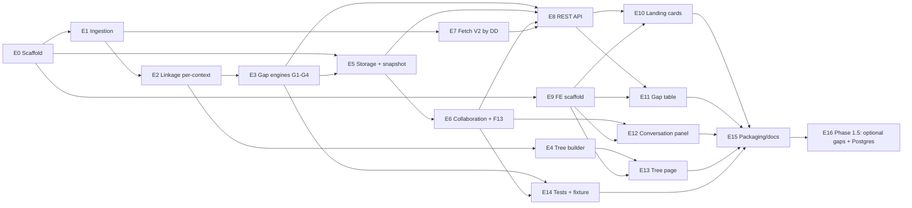

# Implementation Plan
## V2.1 → V1 Schema Conversion — Data Impact & Gap-Analysis Dashboard

| | |
|---|---|
| **Document type** | Implementation Plan / Work Breakdown |
| **Project** | V2.1 → V1 Message Schema Conversion — Data Impact Analysis |
| **Version** | 1.0 (Draft) |
| **Date** | 2026-06-05 |
| **Based on** | HLD v1.2, LLD v1.2 |
| **Status** | For review / planning |

> Scope of this plan = **Phase 1** (the local, full-feature build) in detail, with **Phase 1.5** outlined. Phase 2 (security, deployment, the actual transformation engine) is out of scope per the requirement. Estimates are in **Ideal Engineering Days (IED)** assuming one full-stack engineer; where work splits cleanly the BE/FE column shows it. Nothing here introduces data beyond the workbook columns.

---

## 1. Delivery Approach

- **Vertical-slice first.** Get a thin end-to-end path working (ingest → 1 gap → API → 1 card → 1 table) before widening. This de-risks integration early and gives stakeholders something clickable for the "broader discussion".
- **Engine-by-engine.** The four mandatory gap engines (G1–G4) are added one at a time, each with its own unit tests against the golden sample.
- **Contract-first API.** Pydantic models + OpenAPI fixed early so FE and BE proceed in parallel.
- **Durable-by-default.** Build the SQLite-snapshot in-memory repository from the start (not a throwaway dict) so collaboration durability and the F13 retention logic are exercised continuously.
- **Golden fixture as the spec.** The provided `v1.xlsx` / `v2.1.xlsx` become a checked-in fixture with asserted gap counts; every engine and the re-upload retention behaviour are proven against it.

---

## 2. Milestones

| M | Milestone | Contents | Exit criterion |
|---|---|---|---|
| **M0** | Scaffold ready | Repos, tooling, CI-less local run, config | `make dev` starts BE+FE; `/health` green |
| **M1** | Thin vertical slice | Ingestion + G1 + in-memory(+snapshot) + 1 card + 1 table | G1 funnel counts render from real file |
| **M2** | All mandatory gaps | G2/G3/G4 + severity + per-context | All 4 gap types correct on golden fixture |
| **M3** | Collaboration | Threaded comments, status+history, display name, audit | Comment/reply/status persist across restart |
| **M4** | Retention (F13) | Position-independent `gap_id`, IS-anchor, re-upload merge | Comments survive re-upload + row move |
| **M5** | Full UX | Tree page, grid sort/filter/cols/export, bulk, saved views, Fetch-V2-By-DD | All Phase-1 features demoable |
| **M6** | Hardening | Test suite green, perf at ~2k rows, docs | Acceptance checklist (§8) passes |
| **M7** *(1.5)* | Optional gaps + Postgres | G5–G9, PostgreSQL repo, store parity | Same results in-memory vs Postgres |

---

## 3. Dependency / Sequencing Overview

**Critical path:** E0 → E1 → E2 → E3 → E5 → E6 → E8 → E11 → E15.

---

## 4. Work Breakdown Structure (Phase 1)

> Task IDs are `T-<epic><n>`. Each task lists **Deliverable**, **Acceptance**, **Deps**, **Est (IED)**, **Track** (BE/FE/Both). "LLD §x" references the design source.

### E0 — Project Scaffold & Tooling  *(Track: Both)*
| ID | Task | Deliverable | Acceptance | Deps | Est |
|---|---|---|---|---|---|
| T-E0.1 | Backend scaffold | FastAPI app, `uvicorn` run, settings via `.env` (LLD §12), folder layout (LLD §15) | `GET /api/health` → `{status:"ok"}` | — | 0.5 |
| T-E0.2 | Frontend scaffold | Vite + React 18 + TS, router, TanStack Query client | App boots, calls `/health` | — | 0.5 |
| T-E0.3 | Dev ergonomics | `Makefile`/scripts to run BE+FE, sample `.env`, `type_equivalence.yaml` seed (LLD §5.4) | One command starts both | T-E0.1/2 | 0.5 |
| | | | | **Subtotal** | **1.5** |

### E1 — Ingestion & Normalization  *(Track: BE)*  · LLD §3
| ID | Task | Deliverable | Acceptance | Deps | Est |
|---|---|---|---|---|---|
| T-E1.1 | Excel loader | `openpyxl` reader; header-row detection (skips merged "Table 1" title) | Reads both sample sheets to raw dicts | T-E0.1 | 1.0 |
| T-E1.2 | Column mapping | Source→canonical map for V1 (16 cols) & V2.1 (20 cols) (LLD §2.1) | All columns mapped; unknown col → warning | T-E1.1 | 0.5 |
| T-E1.3 | Normalizer | trim/casefold (match-only), sentinel detection, IS/bool/occurrence parsers (LLD §3.2) | Unit tests: `Not APplicable`→empty, `XS:integer` token, `unbounded`→Occurs | T-E1.2 | 1.0 |
| T-E1.4 | Validator + DQ report | row validation, DQ findings (casing/typo/dupes), ingestion summary | Report lists sample DQ items; feeds G9 later | T-E1.3 | 0.5 |
| | | | | **Subtotal** | **3.0** |

### E2 — Domain Model & Per-Context Linkage  *(Track: BE)*  · LLD §2, §4
| ID | Task | Deliverable | Acceptance | Deps | Est |
|---|---|---|---|---|---|
| T-E2.1 | Pydantic canonical models | `V1Field`, `V2Field`, `Occurs`, `SourceRef`, `MappingContext` (LLD §2.2) | Models validate sample rows | T-E1.2 | 0.5 |
| T-E2.2 | Per-context linkage resolver | `Linkage(is, context, v2, v1)`; 3 columns → ≤3 edges; sentinel skip; `LinkIndex` (LLD §4) | One V2 row → up to 3 context edges; orphan (`v1=None`) detected | T-E2.1 | 1.0 |
| T-E2.3 | Indexes | `v1_by_is`, `links_by_is`, `v2_by_dd`, `root_rows_by_path` | O(1) lookups used by engines | T-E2.2 | 0.5 |
| | | | | **Subtotal** | **2.0** |

### E3 — Gap Engines + Severity  *(Track: BE)*  · LLD §5
| ID | Task | Deliverable | Acceptance | Deps | Est |
|---|---|---|---|---|---|
| T-E3.1 | Engine registry + `Gap` model | pluggable registry, `Gap`/`Severity` (LLD §2.3, §5) | Engines toggle via config | T-E2.3 | 0.5 |
| T-E3.2 | **G1 coverage funnel** | A→B→C counts, `resolve_parent_root` (LLD §5.1, §6.2) | Asserted counts on golden fixture | T-E3.1, T-E4.2 | 1.0 |
| T-E3.3 | **G2 occurrence** (per context, arrays) | `occ_equal`, array tagging (LLD §5.2) | Array vs scalar flagged; unbounded handled | T-E3.1 | 1.0 |
| T-E3.4 | **G3 data type** (per context) | type-equivalence map use, unmapped→DQ (LLD §5.3–5.4) | `XS:string`↔`String` match; mismatch flagged | T-E3.1 | 0.75 |
| T-E3.5 | **G4 mandatory/optional** | `Nullable=False⇒Mandatory` (LLD §5.5) | Disagreement flagged per context | T-E3.1 | 0.5 |
| T-E3.6 | Severity assignment | rules from HLD §8 | Critical = G1 set C; configurable | T-E3.2–5 | 0.5 |
| T-E3.7 | **Position-independent `gap_id`** | business-key hash, no SourceRef (LLD §5.7) | Same content → same id across re-read | T-E3.2–5 | 0.5 |
| | | | | **Subtotal** | **4.75** |

### E4 — Tree Builder  *(Track: BE)*  · LLD §6
| ID | Task | Deliverable | Acceptance | Deps | Est |
|---|---|---|---|---|---|
| T-E4.1 | Tree from Node+Level | nested `TreeNode`, array-node badging (LLD §6.1) | Sample tree matches Level path | T-E2.1 | 1.0 |
| T-E4.2 | Parent-root resolver | `resolve_parent_root` indexed by path (LLD §6.2) | Returns Root with Min/Max for a leaf | T-E4.1 | 0.5 |
| T-E4.3 | Gap aggregation per node | counts/rollup of gaps under each node | Tree endpoint shows gap badges | T-E4.1, T-E3.* | 0.5 |
| | | | | **Subtotal** | **2.0** |

### E5 — Storage Abstraction (durable)  *(Track: BE)*  · LLD §8
| ID | Task | Deliverable | Acceptance | Deps | Est |
|---|---|---|---|---|---|
| T-E5.1 | `Repository` interface | Protocol (LLD §8.1) | Both impls conform | T-E3.1 | 0.5 |
| T-E5.2 | In-memory + SQLite snapshot | RAM indexes + durable `comment/gap_status/status_history/saved_view` (LLD §8.2) | Restart → collaboration survives | T-E5.1 | 1.5 |
| T-E5.3 | Query support | filter/sort/paginate `query_gaps` by type/status/severity/context | Server pagination works at 2k | T-E5.2 | 1.0 |
| | | | | **Subtotal** | **3.0** |

### E6 — Collaboration + Retention (F13)  *(Track: BE)*  · LLD §8.4, §9
| ID | Task | Deliverable | Acceptance | Deps | Est |
|---|---|---|---|---|---|
| T-E6.1 | Comment service (threads) | adjacency-list threads, `is_anchor`+`mapping_context` (LLD §2.3, §9.1) | Nested replies assemble correctly | T-E5.2 | 1.0 |
| T-E6.2 | Status service + history | status transitions write `status_history` (LLD §9.3) | History row per change | T-E5.2 | 0.75 |
| T-E6.3 | **Re-upload merge (F13)** | 3-tier merge, stale-flagging, IS-anchored retrieval (LLD §8.4) | New upload + row move → comments retained; `comments_retained` non-decreasing | T-E6.1, T-E3.7 | 1.5 |
| T-E6.4 | Saved views | persist filter/columns/sort presets (LLD §8.3) | View round-trips | T-E5.2 | 0.5 |
| | | | | **Subtotal** | **3.75** |

### E7 — Fetch V2 By DD  *(Track: BE)*  · LLD §10
| ID | Task | Deliverable | Acceptance | Deps | Est |
|---|---|---|---|---|---|
| T-E7.1 | DD lookup service | `v2_by_dd` over loaded workbook, full 20-col row(s) | Known DD → rows; unknown → `[]` | T-E2.3 | 0.5 |
| | | | | **Subtotal** | **0.5** |

### E8 — REST API Layer  *(Track: BE)*  · LLD §7
| ID | Task | Deliverable | Acceptance | Deps | Est |
|---|---|---|---|---|---|
| T-E8.1 | Ingest + summary routes | `POST /ingest`, `GET /summary` | Cards data incl. G1 metrics | T-E3.*, T-E6.3 | 0.5 |
| T-E8.2 | Gap routes | `GET /gaps`, `GET /gaps/{id}` (+ comments, history) | Filters/sort/paginate honoured | T-E5.3 | 0.75 |
| T-E8.3 | Mutation routes | `PATCH status`, `PATCH status/bulk`, `POST comments` | Bulk + single update + audit | T-E6.* | 0.75 |
| T-E8.4 | Tree / DD / views / export routes | `GET /tree`, `/v2/by-dd/{dd}`, `/views`, `/export` | Multi-sheet export streams | T-E4.3, T-E7.1, T-E6.4 | 0.75 |
| | | | | **Subtotal** | **2.75** |

### E9 — Frontend Scaffold & Shared Components  *(Track: FE)*  · LLD §11
| ID | Task | Deliverable | Acceptance | Deps | Est |
|---|---|---|---|---|---|
| T-E9.1 | App shell + routing | routes `/`, `/gaps/:type`, `/tree`; API client + queries | Navigates between pages | T-E0.2 | 0.5 |
| T-E9.2 | Shared chips | `StatusChip`, `SeverityChip`, `ContextChip`, `GapTypeBadge` | Render all enum values | T-E9.1 | 0.5 |
| T-E9.3 | DisplayNamePrompt | first-use name capture → `localStorage` (LLD §9.2) | Name attached to mutations | T-E9.1 | 0.25 |
| | | | | **Subtotal** | **1.25** |

### E10 — Landing Page (Cards)  *(Track: FE)*  · LLD §11.2
| ID | Task | Deliverable | Acceptance | Deps | Est |
|---|---|---|---|---|---|
| T-E10.1 | Gap cards | one card/type; **G1 card shows A/B/C funnel**; status+severity counts | Click → table route | T-E8.1, T-E9.2 | 1.0 |
| | | | | **Subtotal** | **1.0** |

### E11 — Gap Table Page  *(Track: FE)*  · LLD §11.3
| ID | Task | Deliverable | Acceptance | Deps | Est |
|---|---|---|---|---|---|
| T-E11.1 | DataGrid (TanStack) | columns incl. context/severity; server pagination | Renders 2k rows smoothly | T-E8.2, T-E9.2 | 1.0 |
| T-E11.2 | Sort + filter | column + global + status/severity/context filters | Matches API query params | T-E11.1 | 0.75 |
| T-E11.3 | Column show/hide | visibility menu persisted (localStorage/view) | Hidden cols stick | T-E11.1 | 0.5 |
| T-E11.4 | Export | CSV + multi-sheet XLSX of current view | File downloads | T-E11.1 | 0.5 |
| T-E11.5 | Bulk disposition | row select → `PATCH status/bulk` | N rows updated at once | T-E8.3, T-E11.1 | 0.5 |
| T-E11.6 | Saved views | save/load presets via `/views` | Named view restores state | T-E8.4, T-E11.2/3 | 0.5 |
| | | | | **Subtotal** | **3.75** |

### E12 — Conversation Panel  *(Track: FE)*  · LLD §9, §8.4
| ID | Task | Deliverable | Acceptance | Deps | Est |
|---|---|---|---|---|---|
| T-E12.1 | Threaded comments UI | nested replies, reply box per node, optimistic add | Facebook-style thread renders | T-E8.3, T-E9.3 | 1.25 |
| T-E12.2 | Status control + history view | status dropdown + history timeline | Change reflected + audited | T-E8.3 | 0.5 |
| T-E12.3 | "Earlier discussion for IS" divider | renders IS-anchored retained comments (F13) | Retained thread visible post re-upload | T-E12.1, T-E6.3 | 0.5 |
| T-E12.4 | Fetch-V2-By-DD modal | calls `/v2/by-dd`, shows 20-col row(s) | Known/unknown DD handled | T-E8.4 | 0.5 |
| | | | | **Subtotal** | **2.75** |

### E13 — Tree Page  *(Track: FE)*  · LLD §11.4
| ID | Task | Deliverable | Acceptance | Deps | Est |
|---|---|---|---|---|---|
| T-E13.1 | Virtualized V1 tree | `GET /tree`, array-node badges, gap-count badges | 2k nodes scroll smoothly | T-E8.4, T-E9.2 | 1.0 |
| T-E13.2 | Node gaps panel | select node → its gaps (reuse grid/conversation) | Gaps under root shown | T-E13.1, T-E11.1 | 0.5 |
| | | | | **Subtotal** | **1.5** |

### E14 — Testing & Golden Fixture  *(Track: Both)*  · LLD §14
| ID | Task | Deliverable | Acceptance | Deps | Est |
|---|---|---|---|---|---|
| T-E14.1 | Golden fixture | checked-in `v1.xlsx`/`v2.1.xlsx` + asserted counts per gap/context | Fixture test green | T-E3.* | 0.5 |
| T-E14.2 | Unit tests | normalization, occurrence, type-map, parent-root, each engine | Coverage on core logic | T-E3.*, T-E1.3 | 1.5 |
| T-E14.3 | Integration tests | ingest→summary→gaps→comments→status→bulk | Happy path green | T-E8.* | 1.0 |
| T-E14.4 | Durability + retention tests | restart survives; **re-upload + row-move retains comments**; `comments_retained` non-decreasing | F13 proven | T-E6.3 | 1.0 |
| T-E14.5 | Scale test | synthetic ~2k rows + 3-context + array nodes | < few-sec ingest/analyse; UI responsive | T-E8.*, T-E11.1 | 1.0 |
| | | | | **Subtotal** | **5.0** |

### E15 — Packaging & Docs  *(Track: Both)*
| ID | Task | Deliverable | Acceptance | Deps | Est |
|---|---|---|---|---|---|
| T-E15.1 | Run/README | one-command run, config matrix, troubleshooting | New dev runs it in <10 min | all | 0.5 |
| T-E15.2 | Acceptance walkthrough | scripted demo against §8 checklist | Stakeholder sign-off | all | 0.5 |
| | | | | **Subtotal** | **1.0** |

---

## 5. Phase 1.5 (outlined)  · E16

| ID | Task | Deliverable | Est |
|---|---|---|---|
| T-E16.1 | Optional gaps G5–G9 | reverse-orphan, DD mismatch, cardinality, conflict, DQ (HLD §9, LLD §5.6) | 2.0 |
| T-E16.2 | PostgreSQL repository | SQLAlchemy models + DDL (LLD §8.3), config switch | 2.0 |
| T-E16.3 | Store-parity tests | identical results in-memory vs Postgres | 1.0 |
| T-E16.4 | Severity tuning hooks | externalized thresholds | 0.5 |
| | | **Subtotal** | **5.5** |

---

## 6. Effort Summary (Phase 1)

| Epic | IED |
|---|---|
| E0 Scaffold | 1.5 |
| E1 Ingestion | 3.0 |
| E2 Linkage | 2.0 |
| E3 Gap engines | 4.75 |
| E4 Tree builder | 2.0 |
| E5 Storage | 3.0 |
| E6 Collaboration + F13 | 3.75 |
| E7 Fetch V2 by DD | 0.5 |
| E8 REST API | 2.75 |
| E9 FE scaffold | 1.25 |
| E10 Landing | 1.0 |
| E11 Gap table | 3.75 |
| E12 Conversation | 2.75 |
| E13 Tree page | 1.5 |
| E14 Testing | 5.0 |
| E15 Packaging | 1.0 |
| **Phase 1 total** | **≈ 39.5 IED** |
| Phase 1.5 | ≈ 5.5 IED |

> Calendar: one full-stack engineer ≈ **8–9 weeks** for Phase 1 (with buffer); a BE+FE pair working in parallel after M1 compresses this to ≈ **5–6 weeks**. Add ~15% contingency for the data-quality edge cases that 2,000 real rows will expose.

---

## 7. Suggested Sprint Plan (2-week sprints, BE+FE pair)

| Sprint | Goal (milestone) | Headline tasks |
|---|---|---|
| **S1** | M0→M1 thin slice | E0, E1, E2, G1 (T-E3.2), E5 in-memory+snapshot, E8.1–2, E9, E10 |
| **S2** | M2 all gaps | T-E3.3–3.7, E4, E8.2 filters, E11.1–11.2 |
| **S3** | M3→M4 collab + retention | E6 (incl. **F13**), E12.1–12.3, E8.3, durability/retention tests (T-E14.4) |
| **S4** | M5 full UX | E7, E13, E11.3–11.6, E12.4, export/bulk/saved-views |
| **S5** | M6 hardening | E14 remainder (scale), E15, acceptance walkthrough; start E16 if pulled forward |

---

## 8. Acceptance Checklist (Definition of Done for Phase 1)

Grounded directly in the requirement + design:

- [ ] Ingests `v1.xlsx` (16 cols) and `v2.1.xlsx` (20 cols); DQ report shows sample anomalies.
- [ ] Linkage resolves IS across **3 contexts** (Entity/RP IND/RP ORG); orphans detected.
- [ ] **G1** funnel renders `|A|` total-missing, `|B|` Nullable=False, `|C|` parent-Root Min=1 — values asserted against golden fixture.
- [ ] **G2** flags occurrence diffs incl. array vs scalar; **G3** flags type diffs (`XS:*` vs V2 `Data Type`); **G4** flags Mandatory/Optional vs `Nullable=False⇒Mandatory` — all **per context**.
- [ ] Landing page = gap **cards**; click → gap **table**.
- [ ] Table: sort, filter, column show/hide, export (CSV + multi-sheet XLSX), bulk disposition, saved views.
- [ ] Threaded **comments + replies** (Facebook-style) per gap; **status** Open/Accepted/Not-applicable with history; author = locally-entered display name.
- [ ] **Fetch V2 By DD** returns full V2.1 row(s) from the loaded file.
- [ ] Separate **V1 tree** page built from Node+Level; gaps shown under each root; array nodes badged.
- [ ] **Durability:** comments/status survive an app restart (in-memory snapshot).
- [ ] **F13 retention:** after uploading a new Excel (including the same IS on a moved row), comments remain attached by **IS Reference Number**; resolved-gap threads retained as "Earlier discussion for IS"; `comments_retained` never decreases.
- [ ] Responsive at **~2,000 rows** with array nodes and 3-context mappings.
- [ ] **No fabricated data:** every displayed value traces to a source cell.

---

## 9. Delivery Risks & Mitigations

| Risk | Mitigation |
|---|---|
| Real 2k-row file reveals unseen column/value shapes | Loader fails loud on header mismatch; normalization is table-driven and easy to extend; DQ gap (G9) surfaces anomalies rather than crashing |
| Type-equivalence map gaps cause false G3 hits | Map is external config; unmapped tokens flagged, never silently matched |
| Per-context fan-out inflates gap volume → review fatigue | Severity ranking, context filter, bulk disposition, saved views all in Phase 1 |
| F13 retention edge cases (split/merged IS, renamed attributes) | Two-tier anchor (gap business-key + `is_anchor`), stale-not-delete, non-decreasing assertion; covered by T-E14.4 |
| Tree depth/array recursion hurts UI perf | Virtualized tree + server pagination, validated in T-E14.5 |
| Single-dev bottleneck on critical path | After M1, FE (E9–E13) parallelizes against the fixed API contract |

---

## 10. Out of Scope (Phase 2 — not estimated here)
Security/auth/RBAC, deployment/CI-CD, encryption, and the actual V2.1→V1 **transformation engine**. This tool informs that engine; it does not perform the conversion.

---
*End of Implementation Plan. Companions: HLD v1.2, LLD v1.2.*
